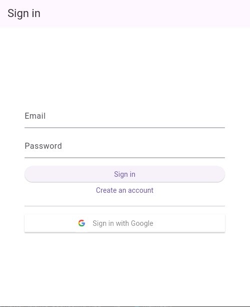
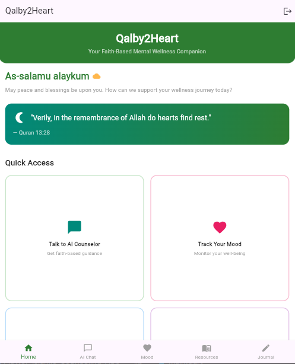
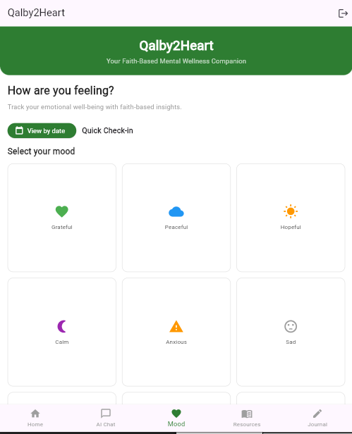
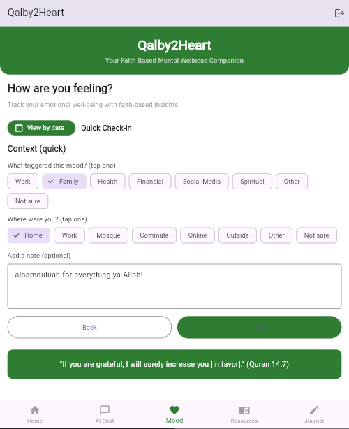
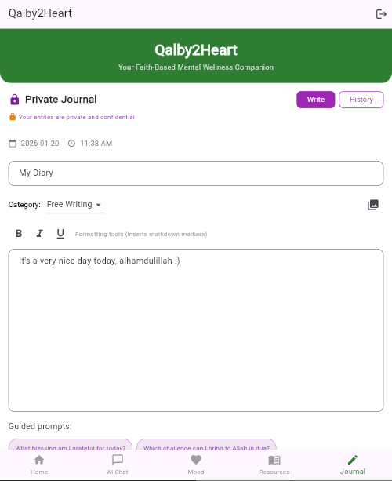
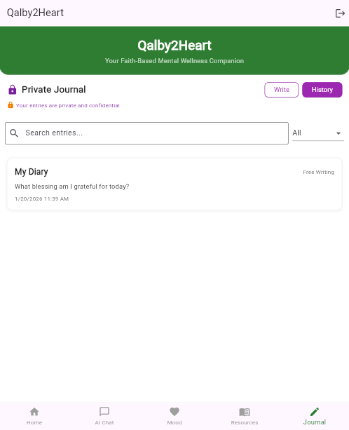

# Qalby2Heart - Final Project Report

## Summary of Achieved Features

Qalby2Heart is a Flutter-based Islamic mental wellness app designed to provide faith-based support for emotional well-being. The following features have been successfully implemented:

### Core Features
- **User Authentication**: Email/password and Google Sign-In support for both mobile and web platforms
- **Mood Tracking**: Users can log their daily moods with intensity levels, triggers, locations, and notes
- **Journaling**: Private journal with categorized entries, prompts, and image attachments
- **Islamic Resources**: Curated Quran verses and Hadith for mental health support
- **Data Persistence**: All user data is stored in Firestore with proper user isolation

### User Interface
- Clean, intuitive navigation with bottom tab bar
- Responsive design with Islamic-themed UI elements
- Offline mode support for development and testing
- Platform-specific authentication handling (mobile vs web)

### Data Management
- **Firestore Collections**:
  - `user_profiles`: User account information
  - `mood_entries`: Daily mood logs with metadata
  - `journal_entries`: Journal posts with categories
  - `resource_searches`: Search history tracking
  - `resource_filters`: Filter preference tracking
- Secure data access with Firebase Authentication integration

## Technical Explanation

### Technology Stack

* **Framework**: Flutter (Dart) for cross-platform mobile and web development
* **Backend**: Firebase Authentication and Cloud Firestore for secure user management and data storage
* **AI Integration**: OpenRouter API utilizing the DeepSeek model to provide conversational AI-based counseling
* **State Management**: Stateful widgets with `setState` for UI updates and state control
* **Networking**: `http` package for direct REST API calls to Firestore and AI services
* **Authentication**: Firebase Auth with platform-specific providers (email/password and Google OAuth)

### Architecture

The system follows a **MVVM-like architecture**, where the UI layer is separated from the data layer to ensure modularity and maintainability.

* **UI Layer (Screens)**: Handles user interface, navigation, and presentation logic
* **Service Layer**: `FirestoreService` is responsible for all data operations, including CRUD functionality
* **Platform Detection**: Uses `kIsWeb` to manage platform-specific authentication flows and configurations
* **Error Handling**: Includes comprehensive exception handling with user-friendly messages and feedback

### Key Technical Decisions

* **Direct REST API Integration**
  Firestore SDK was bypassed to maintain full control over network operations and to avoid compatibility issues on web platforms.

* **User Document Identification**
  User profiles are stored using Firebase UID as the document ID to prevent duplicate profiles and ensure data consistency.

* **Timestamp Standardization**
  All timestamps are stored in UTC format to ensure consistent date filtering and cross-timezone accuracy.

* **Authentication Guards**
  `StreamBuilder` is used to monitor authentication state changes and ensure seamless UI transitions between login and home screens.

### Firebase Integration

* **Authentication**
  Supports email/password authentication and Google OAuth for secure login and account management.

* **Firestore Security Rules**
  Configured to allow access only to authenticated users, ensuring data privacy and integrity.

* **Platform Configuration**
  Android and web platforms are configured separately, with web configuration requiring manual setup through Firebase Console.

---

## Limitations and Future Enhancements

### Current Limitations

* **Firebase Web Configuration**
  Web options are currently placeholders and require manual configuration via Firebase Console.

* **AI Counseling**
  AI chat provides empathetic responses and Quranic verse recommendations, but requires further refinement for deeper counseling accuracy.

* **Offline Synchronization**
  The app does not support full offline data synchronization or local caching beyond basic offline mode.

* **Input Validation**
  Limited validation and sanitization of user inputs may lead to inconsistent or incorrect data entries.

* **Performance**
  The application does not yet implement caching, pagination, or optimization for large datasets.

* **Security**
  Firestore rules are basic and require further hardening for production deployment.

### Future Enhancements

* **AI Enhancement**
  Improve counseling quality by integrating advanced Islamic counseling methodologies and personalized recommendations.

* **Push Notifications**
  Add reminder notifications for mood tracking, journaling, and counseling follow-ups.

* **Data Analytics**
  Introduce user insights, progress tracking, and behavioral analytics for self-improvement monitoring.

* **Social Features**
  Implement community support groups or sharing options with strict privacy controls.

* **Multilingual Support**
  Provide Arabic and English localization for broader accessibility.

* **Advanced Search**
  Implement full-text search functionality for journals and resources.

* **Backup & Restore**
  Add data export/import options to allow users to backup their data securely.

* **Wearable Integration**
  Integrate mood tracking via wearable devices for real-time monitoring.

* **Therapist Integration**
  Provide professional referral systems for users requiring advanced support.

* **Progressive Web App (PWA)**
  Enhance web version with PWA capabilities for improved performance and offline experience.

### Technical Improvements

* **State Management Upgrade**
  Migrate to Provider or Riverpod for improved scalability and maintainability.

* **Testing Strategy**
  Introduce unit, widget, and integration tests to ensure application reliability.

* **CI/CD Implementation**
  Use GitHub Actions for automated testing and deployment pipelines.

* **Error Monitoring**
  Integrate Crashlytics or similar tools for production-level monitoring and issue tracking.

* **Performance Optimization**
  Implement lazy loading, pagination, and efficient data querying to support large datasets.

## Final UI Screenshots

### Login Screen
#### User need to sign in to a valid email address to use the app:

### Home Screen
#### This is Qalby2Heart home screen:

### AI Chat
#### User can have a sharing session with our AI counselor:

### Mood Tracker
#### User can select their mood:

#### User can also add note based on their mood:

### Resources
#### User can find resource:

### Journal
#### User can write their private journal:

#### User can see their journal history:

---

**Project Status**: Core functionality complete with recent AI integration updates deployed to GitHub  
**Repository**: https://github.com/jannahnaimah/Flutter-Islamic-Counseling-App.git  
**Date**: January 20, 2026</content>
<parameter name="filePath">C:\Users\njnna\AndroidStudioProjects\Qalby2Heart\REPORT.md
